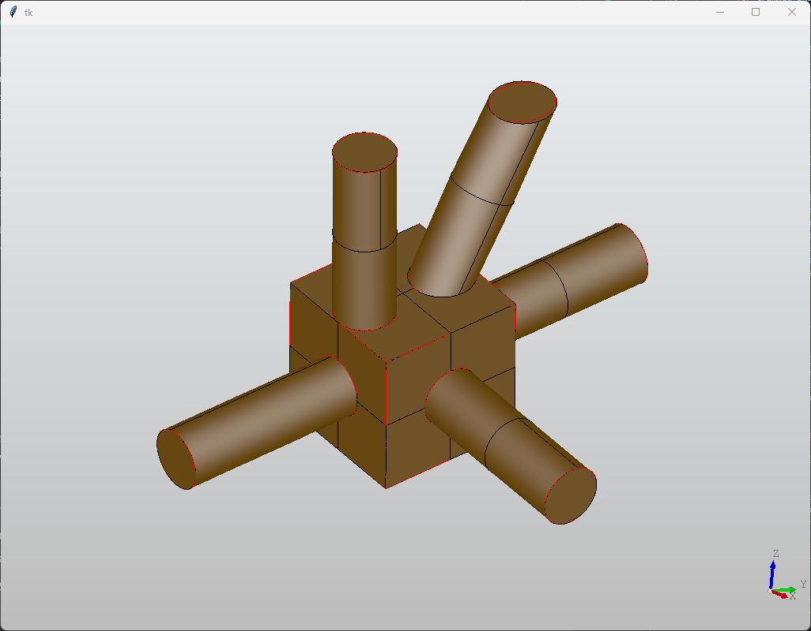
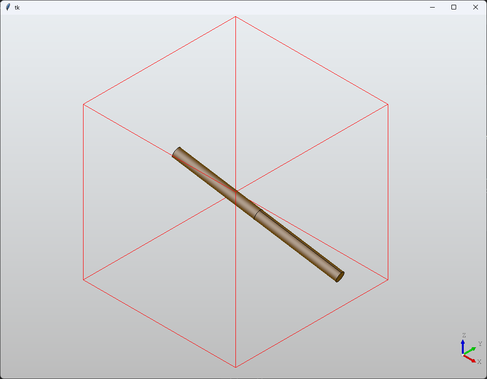
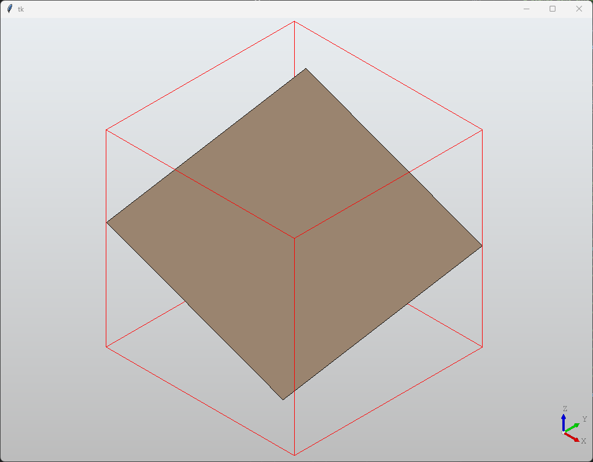
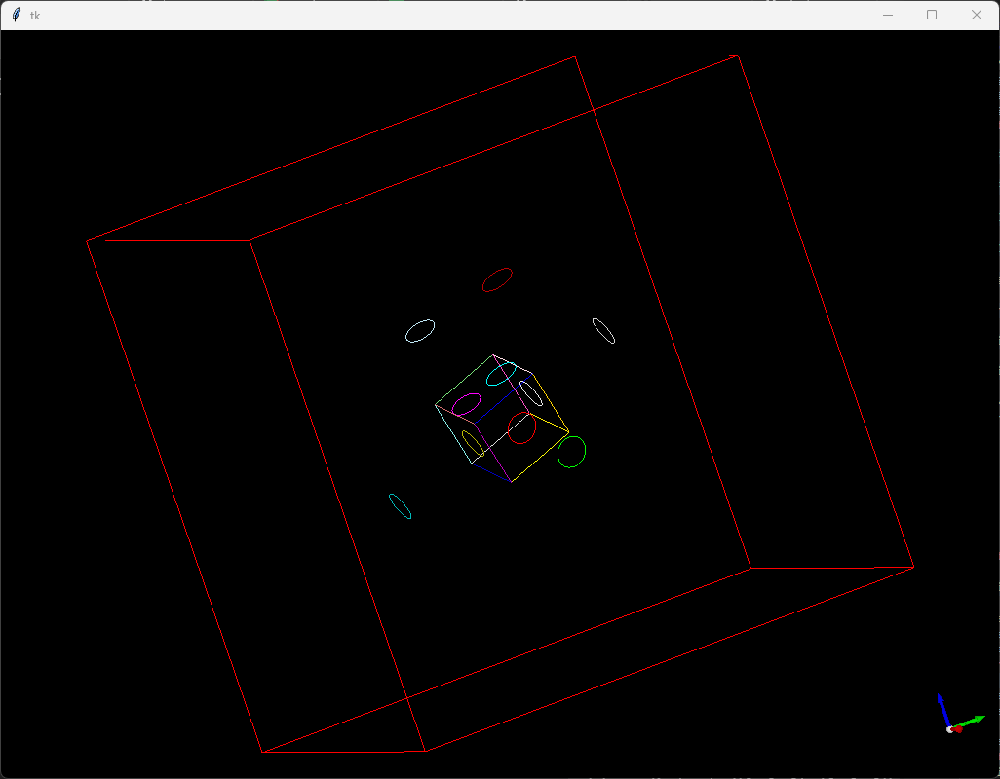
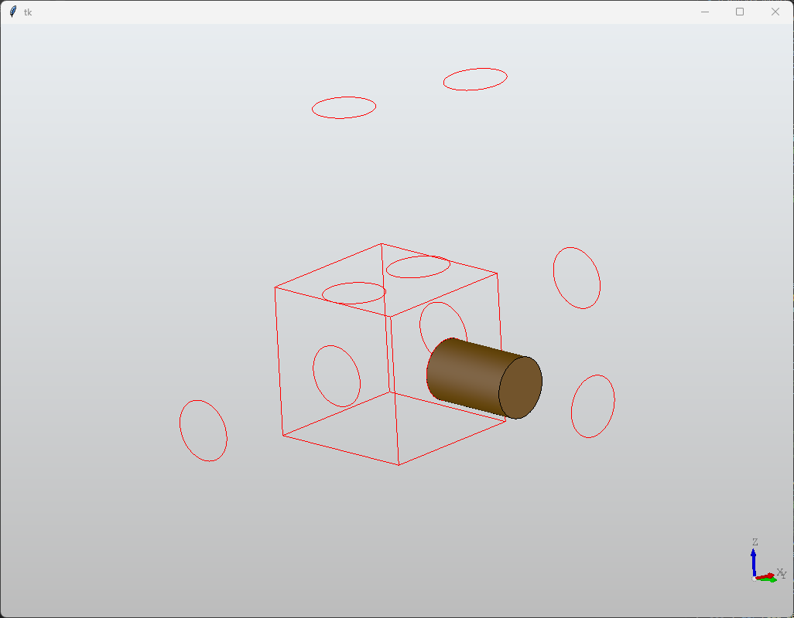
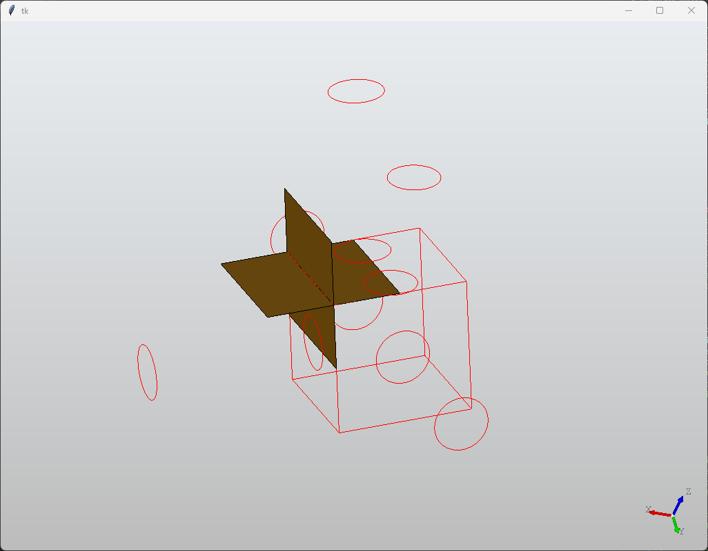
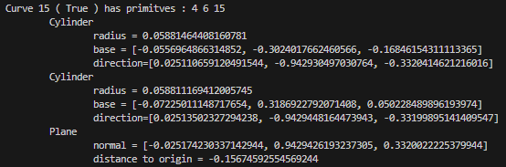

## Document Scope

This document shows the steps and decisions to solve the task of 

> Given a list of primitives and a list of curves, construct the BRep by trimming the primitives using the curves

With the result from `python trim.py` (which also saves the files `trimmed.stl` and `trimmed.step`) looking as



## Development Environment

* Windows 11
* Python 3.11.x
* pythonocc-core (Python binding to OCCT 7.8.1)

> An *easy* way of getting pythonocc-core is via the conda Python distribution. There is even a non-heavy version named miniconda (only around 100MB of executable to download).

> One could do straight OCCT from C/C++ but that requires some time for setting up and can be quirky/troublesome on Windows

## 1. How are the inputs provided?
<details><summary>Show Content</summary>

The inputs (primitives and curves) are **two json files**, `surface_info.json` and `topo.json` respectively, which are described as the following

- For the `surface_info.json` each entry has 4 fields (`id`, `type`, `params`, and `err`). The relevant one is the `params` field since it provides the actual geometrical information about the shape of the primitive.
    
    For the purposes of the task the two possible primitives are a <u>plane</u> and a <u>cylinder</u>. For the plane the params field have a normal and a distance (with respect to the origin). For the cylinder the params are its axis, a point on the axis, and the radius.

    > Note that nothing tells us that a vector (either the normal of a plane or the axis of a cylinder) is normalized (length 1) so it is something to not forget down how a solution to the task is constructed

    The `err` field is worth noticing since it represents the tolerance of how each primitve was constructed. It is not the topic of this solution but each primitive comes from fitting a *surface* to a point cloud which an implementation can be seen [here](https://github.com/prs-eth/point2cad/blob/81e15bfa952aee62cf06cdf4b0897c552fe4fb3a/point2cad/fitting_one_surface.py#L4) and its theory is part of the field of 3D reconstruction/Computer Vision where for example the [RANSAC](https://en.wikipedia.org/wiki/Random_sample_consensus) is something to check if you want to understand more about it.

    What is important for the task is that `err` is a good example of *engineering trade-off* since dealing with floating-point precision makes discrepancies between math on paper and math on a computer.

- The `topo.json` contains 2 fields (`curves` and `corners`). The curves is the *relevant* one representing a curve via a list of points and a list of indices into the list of points.

    > Note that nothing tell us about the ordering of the indices for a curve, thus one cannot assume that the list of segments for a curve are one after another.

How about some visualization of these files? Since `pythonocc-core` provides creation of BRep surfaces as well as visualization capabilities one can do simply
```Python
# Show a shape (display_shape) as long is the type of TopoDS_Shape
# Cylinder -> BRepPrimAPI_MakeCylinder().Shape()
# Plane    -> BRepBuilderAPI_MakeFace().Face()
# Edge     -> BRepBuilderAPI_MakeEdge().Edge()
from OCC.Display.SimpleGui import init_display
display, start_display, _, _ = init_display()
display.DisplayShape(display_shape, update=False)
display.FitAll()
start_display()
```

> On Windows the OCCT visualizer opens a window that seems to be empty but as soon one does a click with the mouse the scene will appear, this seems to be a bug in their rendering so don't panic if you don't see anything when running the program

<details><summary>Show Primitives Samples</summary>
    <p align="center">
        
        
    </p>
</details>
<br>
<details><summary>Show Curves</summary>


</details>

<br>

> If one notices, the curves look no more than line segments and circles. This is important since reduces the complexity of the task (as oposed of having a generic curve betwen any intersection of generic primitives) to have just plane-plane and plane-cylinder types of intersections.

</details>

## 2. Check if a curve *belongs* to a primitive
<details><summary>Show Content</summary>

If one recalls geometry, for two vector $u$, $v$ one can have the equations

$\text{Adjacent Side Lengt}_{uv} = \hat{u}\cdot v$

$\text{Opposite Side Length}_{uv} = ||\hat{u}\times v||$

where $\hat{u} = \frac{u}{||u||}$ (i.e. a normalized vector), and $||\quad||$ is the norm operator (which can be for example in $R^3$, $||u|| = \sqrt{u_x^2 + u_y^2 + u_z^2}$).

> Note that this is why we mentioned is important to notice the input files do not provide normalized vectors, if we simply do the math blindly we will have errors in the algorithm

Thus, the problem to check if a curve is in a plane or in a cylinder transforms to

> For a given point $P$ in the curve, does such point satisfies

$\text{Distance from } P \text{ to plane } = \text{Adjacent Side Length}_{NP} = D\quad D\in(0, \infty)$

$\text{Radius from } P \text{ to cylinder axis } = \text{Opposite Side Length}_{d(P-P_0)} = r^2\quad r\in(0, \infty)$

Where $N$ is the normal of the plane, and $(d, P_0)$ the axis and a point in the axis, respectively, of the cylinder.

> One could ask, how to chose $P$ since we are having a list of points? Technically one can choose any of it, after all any should do satisfy the derived equations. In the provided solution we use the 1st index of the points on the curve, i.e. `curve.points[0]`

More relevant that *how to choose* the point $P$ is that how to know if the curve represents a circle or a line? In this case that is *simple* since the indices of a curve will repeat exactly twice (for all points) if it is a circle (or closed curve to be more generic), or will have two indices that appear only once (which will represent the extremes of that open curve)

In the provided solution this is given by this function
```Python
# For a given curve, if list start_end_points is empty
# it means the curve is closed. On the other hand, if
# it has values those will represent the indices (to curve.points)
# to the start and end of that open curve
def find_start_end_of_curve(curve : Curve):
    count = {}
    for line in curve.lines:
        count[line[0]] = count.get(line[0], 0) + 1
        count[line[1]] = count.get(line[1], 0) + 1
    start_end_points = []
    for index_count in count:
        if count[index_count] == 1:
            start_end_points.append(index_count)
    curve.start_end = start_end_points
```

</details>

## 3. Trimming a primitive
<details><summary>Show Content</summary>

Now we have the tools to make the task. So here are the steps for the algorithm to trim a primitive given a curve
1. Find start and end of a curve (i.e. check if it is an open or closed curve)
2. Find the primitives associated to the curve (i.e. check the math described in section 2)
3. Construct the BRep using the primitives (as well the math) associated from previous step

So what do we mean with step 3? OCCT as mentioned in section 1 provides functionality to construct BRep geometry via the following functions
```Python
BRepBuilderAPI_MakeFace()
BRepPrimAPI_MakeCylinder()
```

But there is a condition, those objects cannot be *endless* (extend forever), i.e. one has to provide arguments that will *clip* (or trim) its geometrical representation. One has to go into the documentation (and by that we mean use for example VSCode to analyze what are the possible arguments of such functions) to understand what can be provided as inputs. Let us put the complete signature of those functions that are being used in this solution
```Python
BRepBuilderAPI_MakeFace(TopoDS_Wire wire)
BRepPrimAPI_MakeCylinder(gp_Ax2 axis, float radius, float height)
```

So now we see that there is information that we are missing or we have to find in order for use to create such objects. 

### Finite Cylinder

First, what is `gp_Ax2`? It is no more an OCCT object that can constructed if a point `gp_Pnt` and a direction `gp_Dir` are provided. This is information we already have directly from reading the `surface_info.json` file, which in the math of section 2 we label as $P_0$ and $d$ respectively.

Second, the radius is also provided directly from the file read, so nothing more than just passing it.

The fun one is how to get the height. The information that we have is a point on the curve (which at this point we know is also in that specific cylinder primitive) $P$, a point in the axis $P0$, and the axis direction $d$. If you go back to section 2 you will notice that the height is no more than

$h = |\text{Adjacent Side Length}_{d(P-P_0)}| = |\hat{d}\cdot(P - P_0)|$

where $|\quad|$ is the absolute value operator.

<details><summary>Show Trimmed Cylinder (Curve 0)</summary>


</details>

### Finite Plane

What is `TopoDS_Wire`? This is no more than a collection of edges (ordered) that will form a boundary (in mesh world we call this wireframe). So how do we find which edges? Do not mistake with the edges from the input file `topo.json`, those are certainly part of a plane but here want to construct the plane that contains such line segment.

What information we have? In this case we know is an open curve so we have the start and end of the line segment, let's call those $P_1$ and $P2$. We also have the normal $N$ of the plane that such line segment lives. So, how about if we get a quad with the following 4 points

$V_1 = o - \frac{w}{2}\hat{d_1} - \frac{h}{2}\hat{d_2}$

$V_2 = o - \frac{w}{2}\hat{d_1} + \frac{h}{2}\hat{d_2}$

$V_3 = o + \frac{w}{2}\hat{d_1} + \frac{h}{2}\hat{d_2}$

$V_4 = o + \frac{w}{2}\hat{d_1} - \frac{h}{2}\hat{d_2}$

for the following values

$o = \frac{P_1 + P_2}{2}, d_1 = P2 - P1, d_2 = d_1\times N, w = h = ||d_1||$

It is a little *verbose* such construction but one wins something with it, the plane will have the line segment as one of its axis so no matter the orientation of the normal plane. This is how the code of this looks in the solution
```Python
def make_plane_with_normal_and_tangent_OCCT(
    normal = [0.0, 0.0, 1.0], 
    origin = [0.0, 0.0, 0.0], 
    tangent = [1.0, 0.0, 0.0], 
    length = 1.0):
    e1 = convert_list_to_vec3_OCCT(tangent).Normalized()
    e2 = e1.Crossed(convert_list_to_vec3_OCCT(normal)).Normalized()
    d1 = multiply_vec3_OCCT_with_scalar(e1, length)
    d2 = multiply_vec3_OCCT_with_scalar(e2, length)
    o = convert_list_to_vec3_OCCT(origin)
    p1 = convert_vec3_OCCT_to_pnt_OCCT(o - d1 - d2)
    p2 = convert_vec3_OCCT_to_pnt_OCCT(o - d1 + d2)
    p3 = convert_vec3_OCCT_to_pnt_OCCT(o + d1 + d2)
    p4 = convert_vec3_OCCT_to_pnt_OCCT(o + d1 - d2)
    edge1 = BRepBuilderAPI_MakeEdge(p1, p2).Edge()
    edge2 = BRepBuilderAPI_MakeEdge(p2, p3).Edge()
    edge3 = BRepBuilderAPI_MakeEdge(p3, p4).Edge()
    edge4 = BRepBuilderAPI_MakeEdge(p4, p1).Edge()
    wire = BRepBuilderAPI_MakeWire(edge1, edge2, edge3, edge4).Wire()
    if LOG_TO_CONSOLE:
        print("\t\tCreating plane BRep with (normal and tangent)")
        print("\t\t\tp1 : ", make_pnt_OCCT_to_string(p1))
        print("\t\t\tp2 : ", make_pnt_OCCT_to_string(p2))
        print("\t\t\tp3 : ", make_pnt_OCCT_to_string(p3))
        print("\t\t\tp4 : ", make_pnt_OCCT_to_string(p4))
    return BRepBuilderAPI_MakeFace(wire).Face()
```
<details><summary>Show Trimmed Plane(s) (Curve 2)</summary>



</details>

### Other Geometries

There are other geometries to consider when doing the trimming

> We got by default the caps of a cylinder but what if the plane that was cutting a cylinder were not aligned (the plane normal and the cylinder direction)? In this case this solution what it does is to find the caps at each ends of the *truncated* cylinder and do an operation called **loft** which joins both faces into a solid

> The line segments do intersect to form corners, which means we have to make a way of given a list of our finite planes (quads) that are in the same plane to find their common regions. The solution here uses the boolean operation `BRepAlgoAPI_Common` to find such common regions.

> There is even the situation that a curve has 3 primitives associated. This is odd but it turns out primitives 4 and 6 are *almost* the same, take a look at the following output from the input files

<p align="center">
  
</p>

>Thus one can see that those values for radius and direction are almost the same. This is a topic of cleaning the input data but outside of the scope the task at hand. What the solution does is to compromise and just take one of the cylinders to make the trimming.


</details>

## 4. Final considerations
<details><summary>Show Content</summary>

Although the provided solution is quite *robust* by no means is neither generic or perfect. Thus, this section is a list of *improvements* that would make the provided code better

- Since the beginning we only considered two primitives, plane and cylinder. This can be extended to any other surface as long one is able to describe it via a an equation of the kind $f(x, y) = 0$.

- The curves for the intersections with a cylinder type were *purposely a circle* but those are not the only possibilities when dealing with cylinders. As the matter of fact, there is the simple extension of an ellipse (where the circle is the one case), when the cylinder axis and the plane normal are not parallel, which is a case partially covered by the solution. If you zoom in the cylinders that have a slanted face cut you will notice that such face and the curve do not match (as opposed to when the face is not slanted). Moreover, the intersection of two cylinders is a type of curve that is not present in the `topo.json` file since those curves are more complex.

- We never use the `corners` information. Initially these points look *useless* but the way of finding the intersections of all possible surfaces on a given plane (for our case 4 faces at a time) using its normal as a hash for a hash-table is not unique since planes without a given point int it (commonly its origin) are not unique. One solution is to extend the hash to use also a corner point which *should* make unique those values and thus we will not have to rely on *manually* select the indices that represent a line from the `curves` list.

</details>
